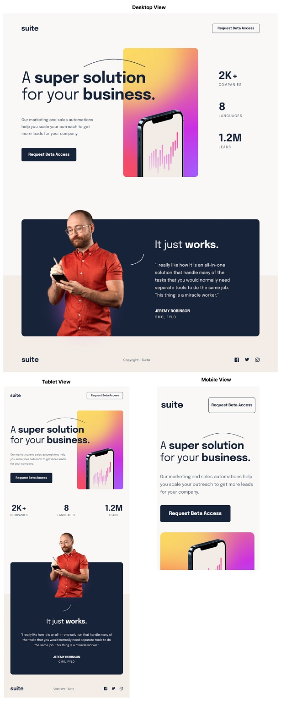

# Suite landing page Project

## Description

This is a solution to AmaliTech's Training Phase 1 challenge.

## Table of Contents
- [Overview](#overview)
    - [Requirements](#requirements)
    - [Screenshots](#screenshots)
    - [Link](#link)
- [Design Process](#design-process)
    - [Built with](#built-with)
- [Author](#author)

## Overview

### Requirements
Users should be able to:

1. View the optimal layout depending on their device's screen size
2. See hover states for interactive elements

### Screenshots

### Link
- Web url: [divine-suite-landing.netlify.app](https://divine-suite-landing.netlify.app/) 

## Design Process

### Built with
- HTML5 
- CSS 

## Author
- Divine Duah
- Email:
    - duahdivine1@gmail.com
    -  divine.duah@amalitech.org

